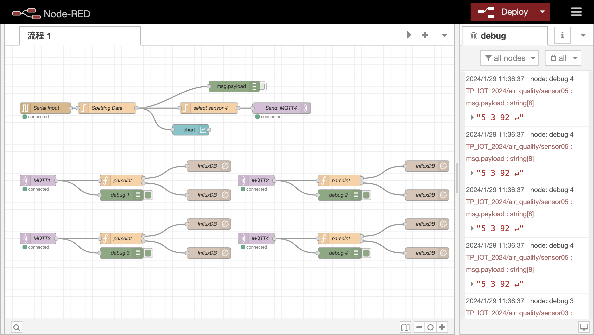
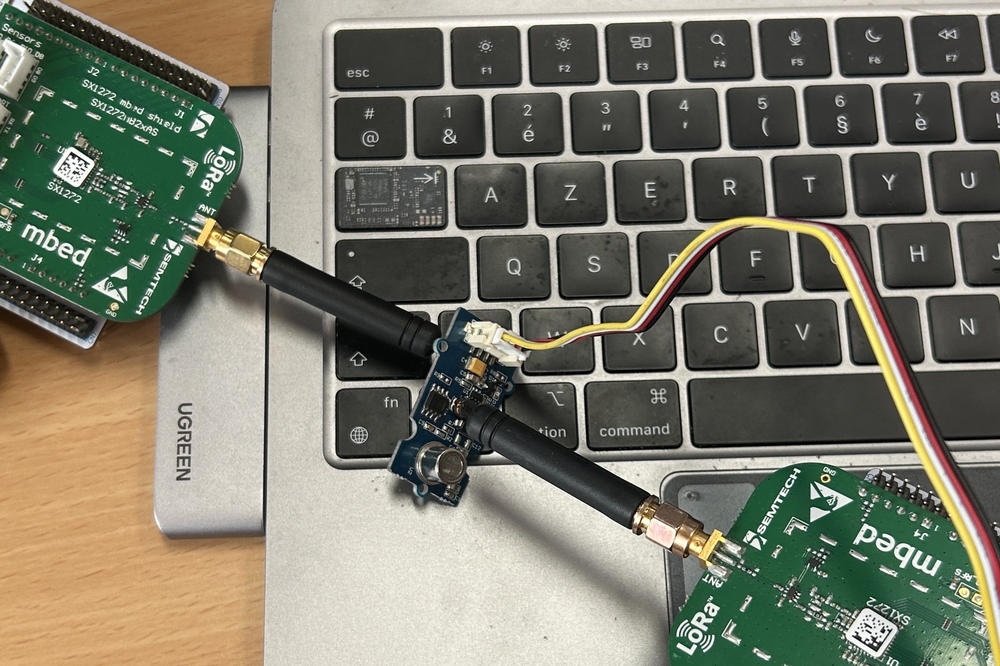

# Système de surveillance de la pollution de l'air intérieur

## Introduction
L'utilisation de LoRaWAN, Node-RED, MQTT et du tableau de bord pour surveiller la qualité de l'air intérieur.

## Structure du projet
Décrivez les principaux composants de votre projet, y compris :

- [x] Module LoRaWAN
- [x] Capteurs de qualité de l'air
- [x] Flux Node-RED
- [x] Configuration MQTT
- [x] Tableau de bord pour la visualisation

> 《何同学天线增益原理:)hahahaha》**STUDIO**: https://studio.keil.arm.com/
